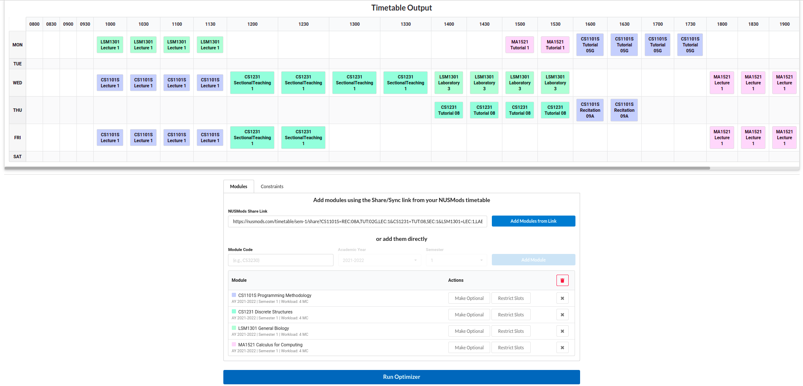

# NUS Timetable Optimizer

Codebase for <a href="https://optimize.sriramsami.com" target="_blank">the NUS Timetable Optimizer</a>, a tool to help students at the National University of Singapore to optimize their timetables to their liking.

## Features
- Allows users to optimize their NUS timetable based on their specified constraints, for example:
      - Allocate one or more free days 
      - Reserve time every day for lunch
      - Avoid classes that start too early or end too late
      - Allow certain modules to only be taken ("Optional Modules") if they meet the above constraints
      - Select a combination of modules that meets these constraints but maintain a minimum and maximum workload
- Uses the NUSMods API to keep up-to-date.
- Tries to prevent all students balloting for the same timetable by randomizing the final timetable output.
- Runs completely on the client browser, which keeps the optimizer responsive regardless of the number of people using the system.

## Building and Running
1. Clone this repository
1. Run `npm install`
1. Run `update_smtlib2.sh` if on Linux, otherwise just run `npm link node-smtlib2/` to link the project's internal modifications of the `node-smtlib2` library into `node_modules`
1. Run `npm start` to start the server

For production builds, run `npm run build`, which builds all assets into the `build/` folder

## How does this work?
- The front-end is written in React, and the app is served from Netlify.
- Module information is populated from the NUSMods API, which is cached for at least 24 hours.
- When a "Run Optimizer" call is initiated, a WebWorker is called to execute a WebAssembly version of the Microsoft Z3 SMT Solver.
- There is a two-phase solving process, one to decide which weeks to simulate in the academic calendar based on the modules selected, and one to actually solve for the final timetable.
- The timetable and constraints specified by the user translated into SMTLIB2 code, which is passed to the WebWorker, and eventually the solver.
- The results are passed back to the display components, which populate the timetable.
- A separate document will be written to explain the technical details of how this problem was encoded into the Z3 SMT (SMTLIB2) format. Some ideas for the encoding were taking from <a href="https://github.com/raynoldng/orbital-splashdown/blob/master/Splashdown_Technical_Report.pdf" target="_blank">this technical report</a> by another attempt to solve this problem.

## Temporary Disclaimers
- The code style / linting / other tools for this project are still being set up. 
- The code style itself is incredibly inconsistent for now.
- Not many best practices are in place at the moment, but that will improve over time.
- There are a few tests, but not with significant coverage.

## Contributing
- Please do open a new Issue if you encounter a bug, or would like a particular feature added.
- Feel free to send a pull request to add features as well.
